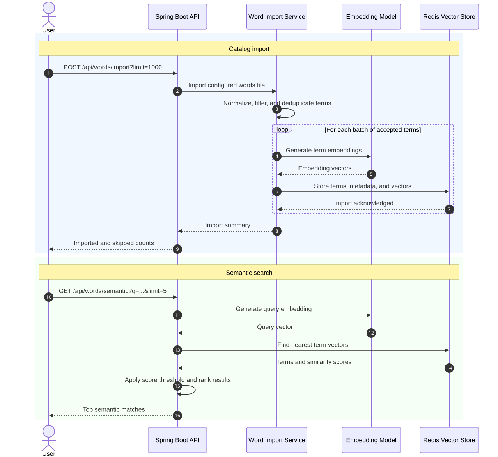

# Semantic Extractor

Semantic Extractor is a small Spring Boot proof of concept for comparing
lexical search with AI-powered semantic search.

The application uses a Linux dictionary as a synthetic catalog. Each accepted
term is stored in Redis and, once the embedding integration is enabled, is
represented by a vector generated with an embedding model. A natural-language
query can then retrieve terms that are conceptually related even when they do
not contain the query text.

The project deliberately focuses on the retrieval workflow. It is not intended
to be a production search service.

## Architecture



The Spring Boot application uses a provider-neutral embedding interface. Ollama
serves IBM Granite locally for repeatable development, while the watsonx.ai
adapter provides the cloud integration option. Redis Stack stores catalog terms
and supports both lexical and vector search.

The editable Mermaid source is available at
[`docs/diagrams/semantic-extractor-architecture.mmd`](docs/diagrams/semantic-extractor-architecture.mmd).

## Process



The editable Mermaid source is available at
[`docs/diagrams/semantic-extractor-sequence.mmd`](docs/diagrams/semantic-extractor-sequence.mmd).

### Catalog import

The provided Make target creates a deterministic sample distributed throughout
`/usr/share/dict/words` and submits it to the application. The import flow:

1. normalizes terms to lowercase;
2. rejects unsupported values and word lengths;
3. removes duplicates;
4. generates embeddings in batches with the selected provider;
5. stores the accepted terms, metadata, and vectors in Redis; and
6. creates indexes for lexical and vector search.

The dictionary is synthetic, non-sensitive data used to simulate a larger
catalog. Isolated words are not an ideal semantic-search corpus because they
provide little context and can have multiple meanings.

### Search

Lexical search performs a case-insensitive prefix lookup against the Redis
sorted index. It is the conventional, non-AI baseline and works without an
embedding provider.

Semantic search:

1. generate an embedding for a natural-language query;
2. execute a nearest-neighbor search over the term vectors in Redis;
3. return the closest terms with similarity scores; and
4. returns normalized cosine-similarity scores.

Comparing lexical and semantic results demonstrates where embeddings improve
concept-based discovery and where the limited corpus reduces their value.

## API

| Method and path               | Purpose                                           | Status                    |
| ----------------------------- | ------------------------------------------------- | ------------------------- |
| `POST /api/words/import`      | Import newline-delimited terms into Redis.        | Available                 |
| `GET /api/words/lexical`      | Search terms by literal prefix.                   | Available                 |
| `POST /api/embeddings/test`   | Verify the selected embedding provider.           | Available with a provider |
| `GET /api/words/semantic`     | Search terms by vector similarity.                | Available with a provider |
| `GET /actuator/health`        | Verify the application and Redis connection.      | Available                 |

## Technology

- Java 17
- Spring Boot and Spring Web MVC
- Spring Data Redis with Lettuce
- Redis Stack vector search
- Ollama for local model execution
- IBM watsonx.ai Java SDK
- IBM Granite Embedding 30M English
- IBM Granite Embedding 278M Multilingual
- Maven and Podman Compose

The application uses the provider-neutral `EmbeddingClient` interface so the
same import and search workflows can use Ollama or watsonx.ai. Embeddings are
disabled when no provider is selected.

## Local development

### Prerequisites

- JDK 17 or later
- Maven 3.9 or later
- Podman with a Compose provider
- `jq`
- `/usr/share/dict/words`
- watsonx.ai credentials only when testing the cloud provider

### Start Redis

```bash
make redis-up
```

### Start the application

```bash
make run
```

This starts the lexical-only mode. To run semantic search locally, download and
select the small English Granite embedding model:

```bash
make ollama-pull
make run-ollama
```

The local `granite-embedding:30m` model is approximately 63 MB and produces
384-dimensional vectors. Ollama runs as an optional Podman Compose service and
retains the downloaded model in a named volume.

The API listens on `http://localhost:8080`. The root path intentionally has no
handler. Application and Redis connectivity can be checked at
`/actuator/health`.

### Import the catalog

With the application running, use another terminal:

```bash
make import
```

The target checks the application health and imports a fixed 1,000-line sample,
making the POC repeatable without additional arguments. With an embedding
provider selected, import generates vectors in batches, stores them as binary
`FLOAT32` values, and creates the Redis vector index.

Run `make help` to see all available development commands.

[`DEMO.md`](DEMO.md) provides a repeatable walkthrough and suggested recording
structure for presenting the complete workflow.

## watsonx.ai embeddings

The optional watsonx.ai integration requires an IBM Cloud API key, a watsonx.ai project
ID, and the regional service URL. Credentials are supplied through environment
variables and must not be committed to the repository.

```bash
export EMBEDDING_PROVIDER=watsonx
export WATSONX_API_KEY='your-secret-api-key'
export WATSONX_PROJECT_ID='your-project-id'
export WATSONX_URL='https://eu-de.ml.cloud.ibm.com'
make run
```

`WATSONX_URL` must identify the region containing the project. The configured
model is `ibm/granite-embedding-278m-multilingual`, which produces
768-dimensional vectors. The embedding test endpoint validates credentials,
model access, and vector dimensions before catalog import. Switching between
the local and cloud models requires importing with `reset=true`, which rebuilds
the Redis index for the selected vector dimensions.

## Evaluation

The final POC will use a small set of natural-language queries with known
expected terms. Its primary measure is whether an expected term appears among
the first five results. Semantic results will be compared with the lexical
baseline, and unsuccessful queries will be retained rather than excluded.

## Design considerations

- Embeddings are the AI capability; no text-generation model is required.
- Redis provides both term storage and vector similarity search.
- The small fixed corpus limits inference cost and import time.
- The same model must embed both catalog terms and search queries.
- Changing the model or vector dimensions requires rebuilding the Redis index
  and regenerating all embeddings.
- Similarity indicates vector proximity, not factual correctness.
- Search results are suggestions and should not be presented as authoritative.

A production implementation would additionally require governed source data,
access control, privacy controls, observability, model-version management, and
broader quality and bias evaluation.

## License

This project is available under the [MIT License](LICENSE).
